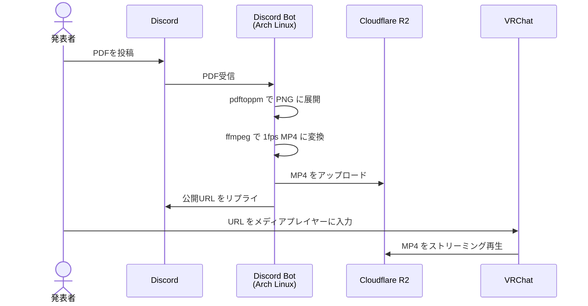

# VRC-LT Server

VRChatのLT会でスライドを投影するための自動変換・配信システムです。  
VRChatではpdfの直接入力ができないため、1スライド1秒のmp4に変換することでスライド投影をしてます。
Discordの任意のチャンネルにpdfを送信することで、pdf->mp4, R2ストレージへのアップロード, 公開URLの取得が行えます。

## システム構成



## 使い方

### 発表者側

1. 発表用PDFを用意する
2. Discordの指定チャンネルにPDFファイルを投稿する
3. Botが `変換完了！` とともにURLを返信するまで待つ（スライド枚数によって数十秒〜数分）
4. 返信されたURLをVRChatのメディアプレイヤーに入力する

### 仕組み

| ステップ | ツール | 内容 |
|---|---|---|
| PDF → PNG | pdftoppm (poppler) | 各ページを150dpi のPNG画像に展開 |
| PNG → MP4 | ffmpeg | 1枚1秒・1920×1080 の MP4 に変換 |
| 配信 | Cloudflare R2 | パブリックバケットで直接配信 |

MP4は `libx264` + `-movflags +faststart` でエンコードされており、VRChatのAVPro Video Playerでページの前後移動が可能です。

## セットアップ

### 必要なもの

- Linux環境（pacmanが利用可能な環境に限る）
- Cloudflare アカウント（R2 バケット）
- Discord Bot トークン（Message Content Intent を有効化すること）

### 手順

**1. リポジトリをクローン**

```bash
git clone https://github.com/yuzukq/VRC-LT-server.git
cd VRC-LT-server
```

**2. R2 バケットの準備**

Cloudflare ダッシュボードで：
- R2 バケットを作成する
- パブリックアクセスを有効化する
- カスタムドメインを設定する（例: `lt.yourdomain.com`）
- API トークンを発行する（`オブジェクトの読み取りと書き込み` 権限）

**3. セットアップスクリプトを実行**

```bash
sudo bash setup.sh
```

**4. `.env` を編集**

```bash
sudo vi /opt/vrc-lt/.env
```

```env
DISCORD_TOKEN=your_bot_token_here
CHANNEL_ID=123456789012345678
R2_ACCOUNT_ID=your_account_id
R2_ACCESS_KEY_ID=your_access_key_id
R2_SECRET_ACCESS_KEY=your_secret_key
R2_BUCKET_NAME=vrc-lt
R2_PUBLIC_URL=https://lt.yourdomain.com
MAX_FILE_MB=50
```

**5. Bot を起動**

動作確認（フォアグラウンド実行）:
```bash
sudo -u vrc-lt /opt/vrc-lt/venv/bin/python /opt/vrc-lt/bot.py
```

常時起動:
```bash
sudo systemctl start vrc-lt-bot
```

ログ確認:
```bash
journalctl -u vrc-lt-bot -f
```
