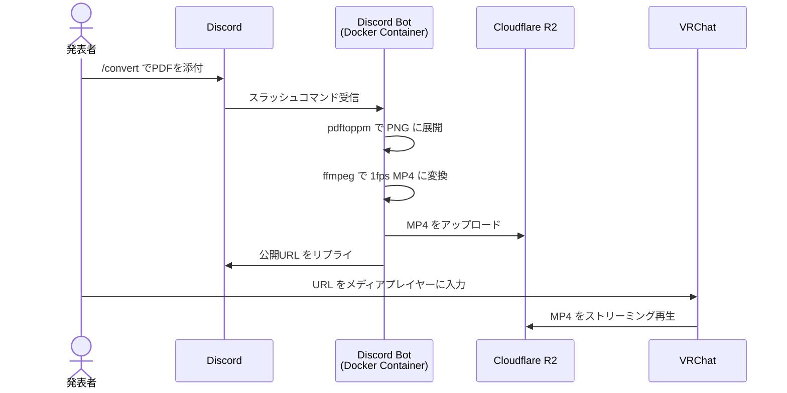

# VRC-LT Server

VRChatのLT会でスライドを投影するための自動変換・配信システムです。  
VRChatではpdfの直接入力ができないため、1スライド1秒のmp4に変換することでスライド投影をしてます。
Discordの指定チャンネルで `/convert` コマンドにpdfを添付することで、pdf->mp4, R2ストレージへのアップロード, 公開URLの取得が行えます。

## システム構成



## 使い方

### 発表者側

1. 発表用PDFを用意する
2. Discordの指定チャンネルで `/convert` コマンドを実行し、PDFファイルを添付する
3. Botが `変換完了！` とともにURLを返信するまで待つ（スライド枚数によって数十秒〜数分）
4. 返信されたURLをVRChatのメディアプレイヤーに入力する

### 仕組み

| ステップ | ツール | 内容 |
|---|---|---|
| PDF → PNG | pdftoppm (poppler) | 各ページを150dpi のPNG画像に展開 |
| PNG → MP4 | ffmpeg | 1枚1秒・1920×1080 の MP4 に変換 |
| 配信 | Cloudflare R2 | パブリックバケットで直接配信 |

MP4は `libx264` + `-movflags +faststart` でエンコードされており、VRChatのAVPro Video Playerでページの前後移動が可能です。

変換中に生成されるPNG/MP4はコンテナ内の `/tmp`（tmpfs）に一時的に書かれるだけで、R2へのアップロード後は自動的に破棄されます。ディスクには一切残らず、コンテナを再起動しても消えます。

## セットアップ

### 必要なもの

- Docker / Docker Compose が使える環境（Linux, macOS, Windows問わず）
- Cloudflare アカウント（R2 バケット）
- Discord Bot トークン

### 手順

**1. リポジトリをクローン**

```bash
git clone https://github.com/yuzukq/VRC-LT-server.git
cd VRC-LT-server
```

**2. R2 バケットの準備**

Cloudflare ダッシュボードで：
- R2 バケットを作成する
- パブリックアクセスを有効化する
- カスタムドメインを設定する（例: `lt.yourdomain.com`）
- API トークンを発行する（`オブジェクトの読み取りと書き込み` 権限）

**3. `.env` を作成**

```bash
cp .env.example .env
vi .env
```

```env
DISCORD_TOKEN=your_bot_token_here
CHANNEL_ID=123456789012345678
R2_ACCOUNT_ID=your_account_id
R2_ACCESS_KEY_ID=your_access_key_id
R2_SECRET_ACCESS_KEY=your_secret_key
R2_BUCKET_NAME=vrc-lt
R2_PUBLIC_URL=https://lt.yourdomain.com
MAX_FILE_MB=50
```

**4. Bot をサーバーに招待**

Discord Developer Portal の OAuth2 → URL Generator で、以下2つのスコープにチェックを入れて生成したURLから招待してください。

- `bot`
- `applications.commands`（これがないと `/convert` コマンドが表示されません）

**5. Bot を起動**

```bash
docker compose up -d --build
```

ログ確認:
```bash
docker compose logs -f
```

停止:
```bash
docker compose down
```
